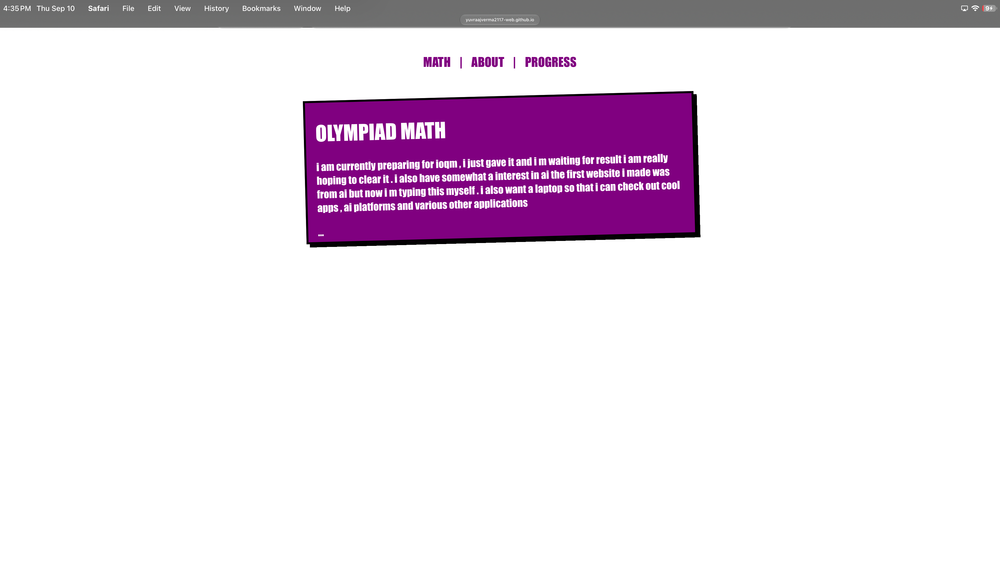
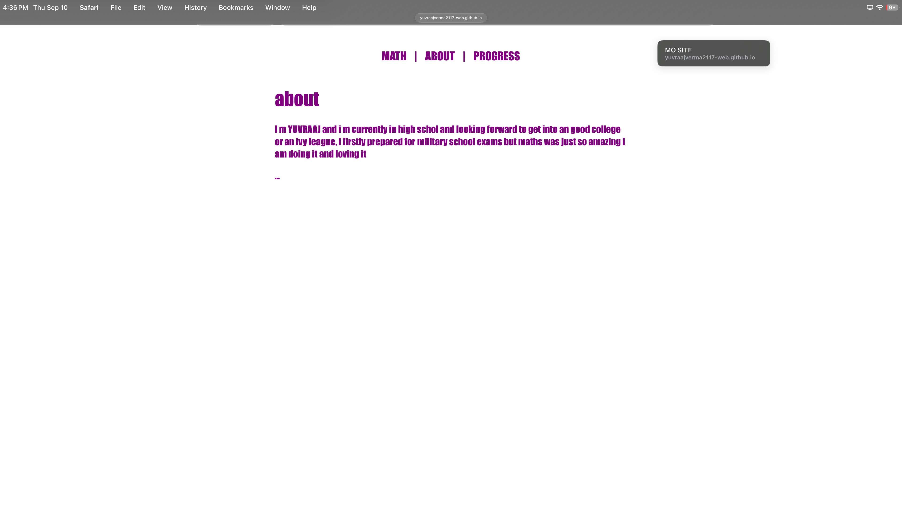
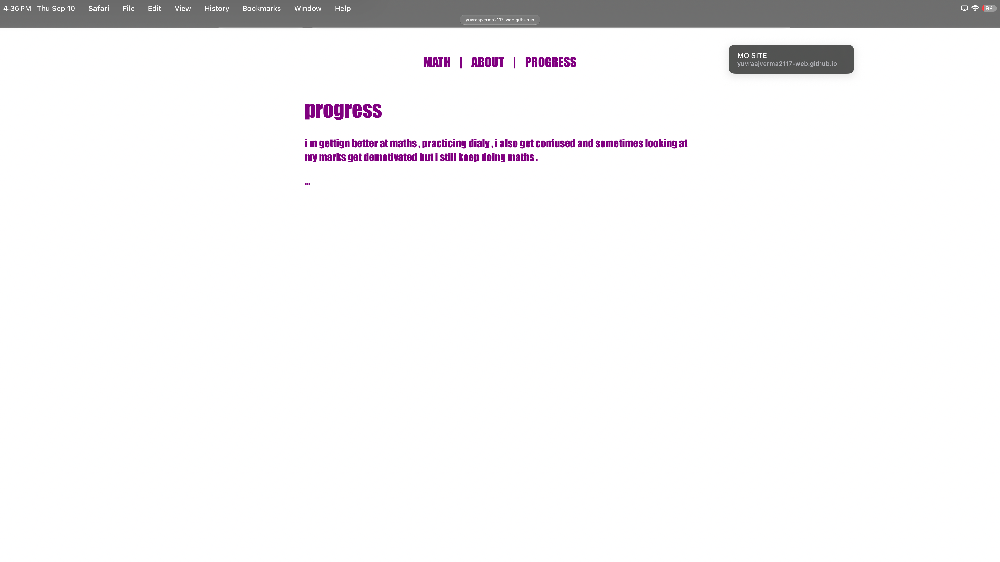

try out my website - https://yuvraajverma2117-web.github.io/MO-SITE
I M JUST A HIGH SCHOOLER AND I MADE TIS.I KNOW BEFORE TIS I MADE WITH AI BUT NOW I MADE IT MYSELF.YOU CAN JUST SEE THE WEBSITE FORM TRY PROJECT . There is nothing much more to tell you can just know about me and see my website and i don’t know why we want readme for even tis website like I know it’s important but don’t know how to write it and what to write in it . I got to writing tis readme in many attempts , ik its funny but stardance is really helping me , also i made tis project to tell abt myself.
## Project Preview

<table>
  <tr>
    <td align="center">
       
      <b>Math Section</b>
    </td>
    <td align="center">
       
      <b>About Section</b>
    </td>
    <td align="center">
       
      <b>Progress Section</b>
    </td>
  </tr>
</table>
i used HTML in it and somewhat CSS for the marker style not much fancy stuff .
